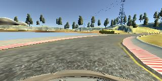

# Behavioral Cloning Project

My submission for term 1 project 3, see [writeup.md](https://github.com/shunjilin/UdacityCarNDBehavioralCloning/blob/master/writeup.md) for details.

Overview
---
This repository contains starting files for the Behavioral Cloning Project.

In this project, you will use what you've learned about deep neural networks and convolutional neural networks to clone driving behavior. You will train, validate and test a model using Keras. The model will output a steering angle to an autonomous vehicle.

We have provided a simulator where you can steer a car around a track for data collection. You'll use image data and steering angles to train a neural network and then use this model to drive the car autonomously around the track.	

