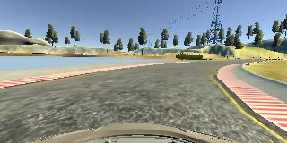

# **Behavioral Cloning**

Shunji Lin

---

**Behavioral Cloning Project**

The goals / steps of this project are the following:

* Use the simulator to collect data of good driving behavior

* Build, a convolution neural network in Keras that predicts steering angles from images

* Train and validate the model with a training and validation set

* Test that the model successfully drives around track one without leaving the road

* Summarize the results with a written report


[//]: # (Image References)

​
[image1]: ./writeup_images/centerlane.jpg

[image2]: ./writeup_images/center_2018_07_09_11_10_10_134.jpg

[image3]: ./writeup_images/left_2018_07_09_11_10_10_134.jpg

[image4]: ./writeup_images/right_2018_07_09_11_10_10_134.jpg

[image5]: ./writeup_images/flipped1.jpg

[image6]: ./writeup_images/flipped2.jpg

[image7]: ./writeup_images/meansquarederror.png


## Rubric Points

### Here I will consider the [rubric points](https://review.udacity.com/#!/rubrics/432/view) individually and describe how I addressed each point in my implementation.  


---

### Files Submitted & Code Quality


#### 1. Submission includes all required files and can be used to run the simulator in autonomous mode


My project includes the following files:

* model.py containing the script to create and train the model

* drive.py for driving the car in autonomous mode

* model.h5 containing a trained convolution neural network 

* writeup.md summarizing the results

* log.txt that shows the log details of training the final model.

* run1.mp4 that shows a video of a lap done by the vehicle in autonomous mode using the model 


#### 2. Submission includes functional code

Using the Udacity provided simulator [Linux](https://d17h27t6h515a5.cloudfront.net/topher/2017/February/58ae46bb_linux-sim/linux-sim.zip), [macOS](https://d17h27t6h515a5.cloudfront.net/topher/2017/February/58ae4594_mac-sim.app/mac-sim.app.zip), [Windows](https://d17h27t6h515a5.cloudfront.net/topher/2017/February/58ae4419_windows-sim/windows-sim.zip). and my drive.py file, the car can be driven autonomously around the track by executing 

```sh

python drive.py model.h5

```


#### 3. Submission code is usable and readable

The model.py file contains the code for training and saving the convolution neural network. The file shows the pipeline I used for training and validating the model, and it contains comments to explain how the code works.


### Model Architecture and Training Strategy

​
#### 1. An appropriate model architecture has been employed

I used a CNN network based on [NVIDIA's end-to-end self driving model](https://devblogs.nvidia.com/deep-learning-self-driving-cars/).

See 2. for the full description of my final model.

#### 2. Attempts to reduce overfitting in the model

Initially I used dropout layers in the fully connected layers to reduce overfitting of the model.

However I found that this hurt the performance (high mean squared error loss) of the model during training quite significantly even with low keep probabilities, and resulted in very long training and iteration times.

Instead I relied on data augmentation techniques to improve the generalizability of the model and reduce overfitting.

Data augmentation includes adding not only the center camera image but also the left and right camera images, and adding an appropriate adjustment factor to the steering angle (+0.2 for left camera and -0.2 for right camera).

Data augmentation also includes adding the flipped images and adjusting the steering angle by taking its negative value.

The model was trained and validated on different data sets to ensure that the model was not overfitting.

The model was tested by running it through the simulator and ensuring that the vehicle could stay on the track.

#### 3. Model parameter tuning

The model used an adam optimizer, so the learning rate was not tuned manually.

#### 4. Appropriate training data

Training data was chosen to keep the vehicle driving on the road.

I only attempted to drive the vehicle as center as possible on the lane.

For details about how I created the training data, see the next section. 


### Model Architecture and Training Strategy


#### 1. Solution Design Approach


I relied on NVIDIA's end-to-end self driving model as described [here](https://devblogs.nvidia.com/deep-learning-self-driving-cars/) as the base of the network architecture as it has proven to be effective in their own self-driving application.


In order to gauge how well the model was working, I split my image and steering angle data into a training and validation set.


I had to tune the number of epochs in order to reduce underfitting and overfitting. I found that too low an epoch number results in underfitting the training set while too high an epoch number results in overfitting the training set. I finally settled on 10 epochs which gave low mean squared error losses on both the training and validation set.

Here is the mean squared error for the training and validation set over the number of epochs:

![alt text][image7]


#### 2. Final Model Architecture


The final model architecture consists of a convolution neural network based on [NVIDIA's end-to-end self-driving model](https://devblogs.nvidia.com/deep-learning-self-driving-cars/).


It is composed of 5 convolutional layers, 4 fully connected layers and an output layer.


It also 2 preprocessing layers, one for normalization and one for cropping.

​
| Layer (type)                     | Output Shape        |

|----------------------------------|---------------------|

| lambda_1 (Lambda : normalization)| (None, 160, 320, 3) |

| cropping2d_1 (Cropping2D)        | (None, 60, 320, 3)  |

| convolution2d_1 (Convolution2D)  | (None, 28, 158, 24) |

| convolution2d_2 (Convolution2D)  | (None, 12, 77, 36)  |

| convolution2d_3 (Convolution2D)  | (None, 4, 37, 48)   |

| convolution2d_4 (Convolution2D)  | (None, 2, 35, 64)   |      

| convolution2d_5 (Convolution2D)  | (None, 1, 34, 64)   |            
 
| flatten_1 (Flatten)              | (None, 2176)        |       

| dense_1 (Dense)                  | (None, 1164)        |

| dense_2 (Dense)                  | (None, 100)         |           

| dense_3 (Dense)                  | (None, 50)          |

| dense_4 (Dense)                  | (None, 10)          |                
 
| dense_5 (Dense)                  | (None, 1)           |

​

Convolutional layers 1,2,3 have 5x5 filter sizes, stride of 2 and depths between 24 and 48.

Convolutional layer 4 has a 3x3 filter size, stride of 1 and depth 64.

Convolutional layer 5 has a 2x2 filter size, stride of 1 and depth 64. 

The model includes RELU layers to introduce nonlinearity.

Data is normalized in the model using a Keras lambda layer.


Data is also cropped (75 pixels top, 25 pixels bottom), to remove unimportant image features such as the scenary in the background and car hood in the foreground.


#### 3. Creation of the Training Set & Training Process

To capture good driving behavior, I recorded two laps on track one using center lane driving.

Here is an example image of center lane driving:



![alt text][image1]

The two laps alone were not sufficient to produce a good model, and the vehicle could not recover when it drove too close to the edges of the lanes (proceeding to drive off lane).


To augment the data set, I also added the left and right camera images, and applied a steering angle correction of +0.2 and -0.2 respectively. This would help simulate recovering from steering too near the edge of the lanes.


Here is an example of an image and its left and right camera images.


![alt text][image2]

![alt text][image3]

![alt text][image4]


With the left and right camera images, the model performs better in simulation but still veers off track on the difficult corners. In order to produce a more generalizable model, I added flipped images and adjusted the angles correspondingly by taking the negative values.

For example, here is an image and its flipped image:

![alt text][image5]

![alt text][image6]

After the collection process, I had 24258 number of data points. 

I finally randomly shuffled the data set and put 20% of the data into a validation set. 

I used this training data for training the model, with a batch size of 32.

The validation set helped determine if the model was over or under fitting. I tried epochs of 5, 10, 15 and 20, and the ideal number of epochs was 10 as a low training and validation mean squared error. I used an adam optimizer so that manually training the learning rate wasn't necessary.

At the end of the process, the vehicle is able to drive autonomously around the track without leaving the road.

​
